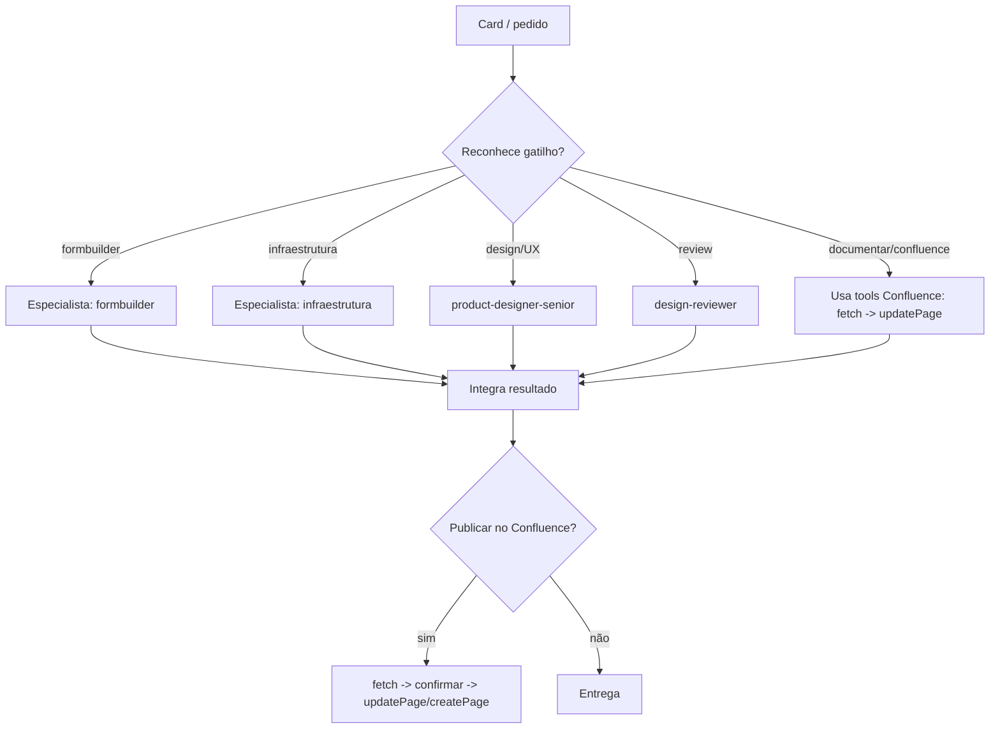

# Padrão de Agentes de IA — Mobile Saúde

> **Planejamento padronizado** para criar agentes especialistas (Claude Code
> subagents) que rodam no **Vibe Kanban**. Cada agente segue o **mesmo esqueleto**:
> identidade · **gatilhos (triggers)** · **ferramentas (tools)** · **system prompt**.
> Há também um **orquestrador** que reconhece termos-gatilho (ex.: `formbuilder`,
> `infraestrutura`) e **roteia** ao especialista, e detém as **tools do Confluence**
> (`fetch`, `updatePage`, …) para publicar/atualizar documentação.
>
> Artefatos relacionados: [`_TEMPLATE.md`](../.claude/agents/_TEMPLATE.md) ·
> [`orquestrador.md`](../.claude/agents/orquestrador.md) ·
> [`formbuilder.md`](../.claude/agents/formbuilder.md) · README em `.claude/README.md`.

---

## 1. Conceitos

| Conceito | O que é |
| -------- | ------- |
| **Agente especialista** | Arquivo `.claude/agents/<name>.md` = **frontmatter** (config) + **corpo** (o *system prompt*). Commitado no repo → todo card do Vibe Kanban herda. |
| **Trigger (gatilho)** | O que faz o agente ser acionado: o campo **`description`** + termos explícitos (ex.: "formbuilder", "infraestrutura", "deploy"). O orquestrador/Claude casa a intenção do card com esses gatilhos. |
| **Tool (ferramenta)** | O que o agente pode usar: ferramentas de código (`Read`, `Edit`, `Bash`…) e **MCP** (ex.: Confluence `fetch`/`updatePage`). |
| **Orquestrador** | Roteador que **não executa** o trabalho do especialista: identifica o gatilho, **delega** ao especialista certo e (quando aplicável) publica no **Confluence**. |

**Princípio central:** *um especialista por tarefa*. O orquestrador decide **quem**;
o especialista decide **como**. Gatilhos bem definidos = roteamento previsível.

---

## 2. Anatomia padrão de um agente

### 2.1 Frontmatter (obrigatório)
```yaml
---
name: <kebab-case · igual ao nome do arquivo>
description: >-
  Use quando <intenção>. GATILHOS: <termo1>, <termo2>, <termo3>.
  NÃO use para <fora de escopo>.
tools: <lista mínima necessária>     # ex.: Read, Grep, Glob, Edit, Write, Bash
model: sonnet                         # sonnet | opus | haiku
---
```
> `description` é o **contrato de gatilho** — escreva-o pensando em quando o
> orquestrador deve escolher este agente. Sempre inclua **GATILHOS:** (termos) e
> **NÃO use para:** (evita overlap entre especialistas).

### 2.2 Corpo (o system prompt) — seções padrão
1. **Papel & identidade** — "Você é um(a) especialista em X no Mobile Saúde…".
2. **Quando você é acionado** — gatilhos + escopo + o que está fora.
3. **Ferramentas & uso** — para cada tool: quando/como usar (regras do Confluence em §4).
4. **Processo** — passo a passo do trabalho (entender → executar → validar).
5. **Guardrails** — regras inquebráveis (escopo, segurança, confirmação de ações externas).
6. **Formato de saída / entregáveis** — o que o agente devolve ao fechar.
7. **Exemplos** — 1–2 casos curtos (entrada → ação).
8. **Escalonamento / handoff** — quando delegar a outro especialista ou ao humano.
9. **Paralelismo no Vibe Kanban** — escopo do card, cuidado com arquivos globais.

---

## 3. Triggers — como declarar

- **No `description`:** comece com "Use quando…", liste **GATILHOS:** explícitos e
  feche com **NÃO use para:**.
- **Gatilhos mutuamente exclusivos** entre especialistas — se dois agentes podem
  casar a mesma frase, refine os termos ou adicione "NÃO use para".
- **Registre no orquestrador** (tabela §5): `termo → agente`.

**Exemplos de mapeamento de gatilho → especialista:**

| Termos-gatilho | Especialista |
| -------------- | ------------ |
| `formbuilder`, `formulário`, `campos`, `validação de form` | `formbuilder` |
| `infraestrutura`, `infra`, `deploy`, `CI`, `pipeline`, `build`, `docker` | `infraestrutura` |
| `tela`, `UX`, `componente`, `design`, `acessibilidade` | `product-designer-senior` |
| `review`, `revisão`, `auditar diff` | `design-reviewer` |
| `documentar`, `confluence`, `publicar página`, `atualizar doc` | `orquestrador` (tools Confluence) |

---

## 4. Tools — catálogo & convenções

**Princípio do menor privilégio:** declare só as tools que o papel exige.

### 4.1 Tools de código (especialistas que tocam o repo)
`Read`, `Grep`, `Glob` (ler/buscar) · `Edit`, `Write` (alterar) · `Bash`
(build/test/lint). Quem só revisa/critica: **sem** `Edit`/`Write`.

### 4.2 Tools do Confluence (MCP) — mapeadas no orquestrador
> Os nomes reais dependem do servidor MCP do Atlassian/Confluence conectado
> (ex.: `mcp__atlassian__confluence_*`). Abaixo, os papéis lógicos:

| Tool (papel) | Uso | Regra |
| ------------ | --- | ----- |
| `fetch` / `getPage` | ler o conteúdo atual de uma página (por id/URL) | **Sempre antes de escrever.** |
| `searchPages` | encontrar a página/espaço certo | confirme o alvo antes de agir |
| `createPage` | criar página nova | informe espaço + título + parent |
| `updatePage` | atualizar página existente | **confirmar antes** · resumir o que muda · citar `pageId` · nunca sobrescrever sem ter feito `fetch` |
| `addComment` | comentar/anotar | preferir a sobrescrever conteúdo alheio |

**Regra de ouro (escrita externa):** ações que **publicam** (create/update/comment)
são *outward-facing* — confirme com o humano, mostre o diff/resumo e cite o
`pageId`. Leitura (`fetch`/`search`) é livre.

---

## 5. O Orquestrador (roteamento por gatilho)

System prompt completo em [`.claude/agents/orquestrador.md`](../.claude/agents/orquestrador.md). Resumo do comportamento:



O orquestrador **não faz** o trabalho do especialista — ele identifica, delega,
integra e, se o resultado precisa virar documentação, usa as tools do Confluence
(sempre `fetch` antes de `updatePage`, com confirmação).

---

## 6. Guardrails padrão (todos os agentes)

- **Escopo do card:** não refatore o que o card não pediu.
- **Arquivos globais compartilhados** (`src/style.css`, `vite.config.ts`,
  `components.d.ts`/`auto-imports.d.ts`, `src/router/*`, stores): alteração mínima
  + sinalize no resumo (o Vibe Kanban roda cards em paralelo → risco de merge).
- **Validação:** `npm run build` (inclui `vue-tsc`) e dev server sobe sem erro.
- **Segurança:** confirme **antes** de ações destrutivas ou *outward-facing*
  (publicar no Confluence, push, deploy). Nunca exponha segredos.
- **Honestidade de status:** se o build falhou ou um passo foi pulado, diga.

---

## 7. Como adicionar um novo agente (checklist)

1. **Copie** [`_TEMPLATE.md`](../.claude/agents/_TEMPLATE.md) → `.claude/agents/<name>.md`.
2. Preencha o **frontmatter** (`name` = nome do arquivo; `description` com GATILHOS + NÃO use para; `tools` mínimas; `model`).
3. Escreva o **system prompt** pelas 9 seções (§2.2).
4. **Sem overlap de gatilho** com agentes existentes (refine termos / "NÃO use para").
5. **Registre no orquestrador** (tabela de gatilhos em `orquestrador.md`).
6. **Menor privilégio** nas tools (quem não escreve não tem `Edit`/`Write`; só quem documenta tem Confluence).
7. **Teste:** `claude` → `/agents` (aparece?) → rode um caso real do gatilho.
8. **Commite** a pasta `.claude/` (Vibe Kanban herda).

---

## 8. Matriz de agentes (manter atualizada)

| Agente | Gatilhos | Tools | Model | Escopo |
| ------ | -------- | ----- | ----- | ------ |
| **orquestrador** | roteamento; `documentar`, `confluence` | Confluence (fetch/update/create) + delegação | opus | roteia + publica doc |
| **formbuilder** | `formbuilder`, `formulário`, `campos`, `validação` | Read, Grep, Glob, Edit, Write, Bash | sonnet | construir/editar formulários |
| **infraestrutura** | `infraestrutura`, `infra`, `deploy`, `CI`, `build`, `docker` | Read, Grep, Glob, Edit, Bash | sonnet | build/CI/deploy/config |
| product-designer-senior | `tela`, `UX`, `componente`, `design`, `a11y` | Read, Grep, Glob, Edit, Write, Bash | sonnet | UI/UX (já existe) |
| design-reviewer | `review`, `revisão`, `auditar diff` | Read, Grep, Glob, Bash | sonnet | revisão de design (já existe) |
