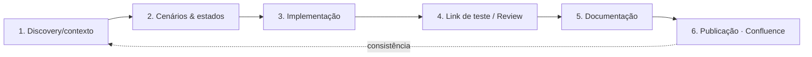

# Playbook de Design de Produto — Mobile Saúde

> Índice vivo do **processo padrão** de design de produto: do contexto à publicação,
> com consistência entre plataformas. Inspirado no fluxo do estrategista de UX
> (Leandro Resende) e ancorado no que o projeto já tem.
>
> Operacionalizado como **skills** (competências do mesmo designer) + **agentes**
> (papéis com tools/permissões próprias). Decisão agente×skill em
> [`PADRAO-AGENTES-IA.md`](PADRAO-AGENTES-IA.md).

## O pipeline

| # | Etapa | Acione | Entregável |
| - | ----- | ------ | ---------- |
| 1 | **Discovery/contexto** | skill `discovery-contexto` | brief: job, usuário, contexto, critério de sucesso |
| 2 | **Cenários & estados** | skill `cenarios-estados` ⭐ | matriz cenário×estado (cobre tudo, não só happy path) |
| 3 | **Implementação** | agente `product-designer-senior` + skills `component-spec`, `design-system-tokens`, `accessibility-audit`, `ux-writing`, `arquitetura-fluxos` | tela/componente no DS, tipado, estados cobertos, Storybook |
| 4 | **Link de teste / Review** | agente `design-reviewer` (read-only) + skill `metricas-heart` | build/dev verde + veredito (Aprovado/Ressalvas/Mudanças) |
| 5 | **Documentação** | skill `documentacao-fluxo` | `docs/<fluxo>.md` (6 seções) + export `.docx`/`.pdf` |
| 6 | **Publicação** | agente `orquestrador` (tools Confluence) | página criada/atualizada (`fetch`→`updatePage`, confirmar antes) |

## Catálogo de skills (o Playbook)

| Skill | Para quê |
| ----- | -------- |
| `playbook` | âncora: por onde começar e o que acionar |
| `discovery-contexto` | contexto/JTBD/restrições antes de desenhar |
| `cenarios-estados` ⭐ | dimensões de cenário + cobertura de todos os estados |
| `arquitetura-fluxos` | IA, rotas, navegação, drill-down |
| `design-system-tokens` | tokens `ms-*`, cascade layers, dark mode |
| `component-spec` | projetar/construir componente (com Storybook) |
| `accessibility-audit` | checklist WCAG 2.1 AA |
| `ux-writing` | microcopy pt-BR |
| `design-critique` | crítica heurística (Nielsen) |
| `metricas-heart` | métricas de sucesso (HEART → KPIs) e link de teste |
| `documentacao-fluxo` | documentar o fluxo e preparar p/ Confluence |

## Catálogo de agentes (papéis)

| Agente | Papel | Tools |
| ------ | ----- | ----- |
| `product-designer-senior` | executor estrategista (design → implementação) | Read, Grep, Glob, Edit, Write, Bash |
| `design-reviewer` | revisor/gate do link de teste (read-only) | Read, Grep, Glob, Bash |
| `orquestrador` | roteia por gatilho + publica no Confluence | Confluence + Task |
| `formbuilder` | especialista em formulários (exemplo) | Read, Grep, Glob, Edit, Write, Bash |

## Princípios de consistência (o "ganho" do Playbook)
1. Reuse antes de criar (Base*/ui).
2. Tokens `ms-*`, nunca cor crua; light **e** dark.
3. Cobertura de estados obrigatória (carregando/vazio/filtrado-vazio/erro/sucesso).
4. Acessibilidade WCAG AA não-negociável.
5. Storybook documenta o DS.
6. Microcopy pt-BR clara e humana.
7. Multi-plataforma (stack nova e a portada — `DE-PARA-STACK-ANTIGA.md`).

## Documentos de referência
- [`PRODUTO-MOBILE-SAUDE.md`](PRODUTO-MOBILE-SAUDE.md) — PRD completo.
- [`VISAO-GERAL-MOBILE-SAUDE.md`](VISAO-GERAL-MOBILE-SAUDE.md) — visão geral.
- [`PADRAO-AGENTES-IA.md`](PADRAO-AGENTES-IA.md) — padrão de agentes (skill×agente, triggers, tools).
- `.claude/README.md` — kit de agentes/skills no Vibe Kanban.
