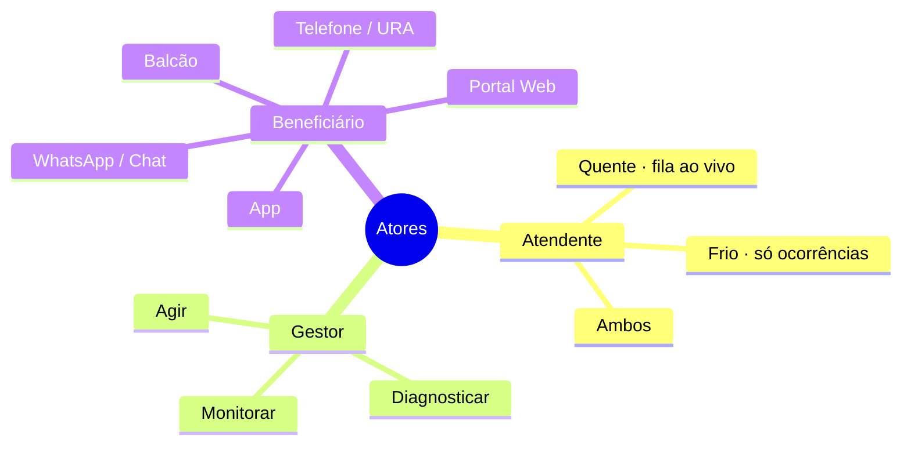
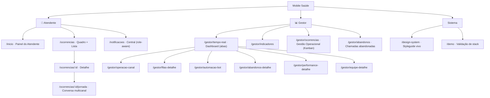
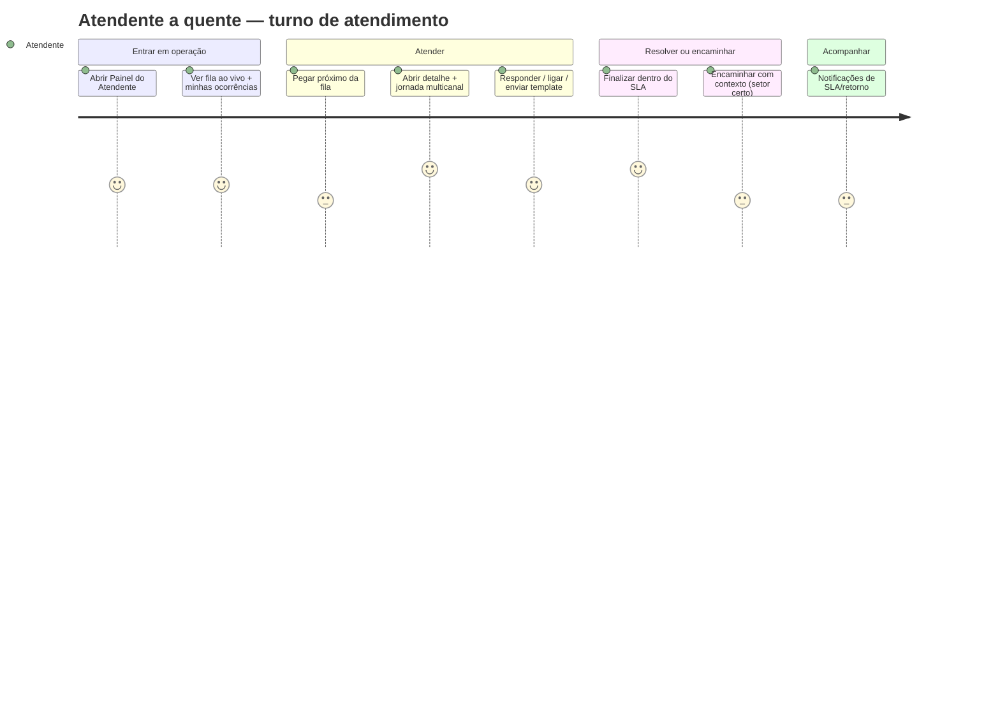
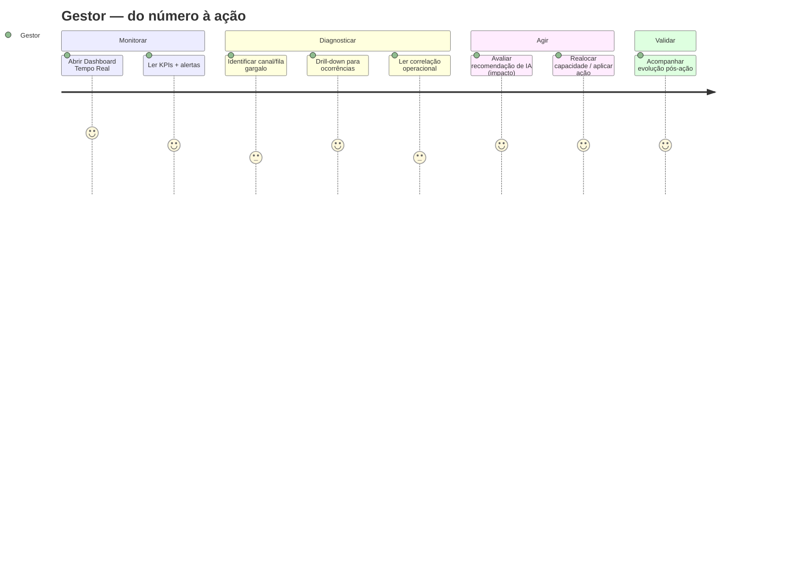
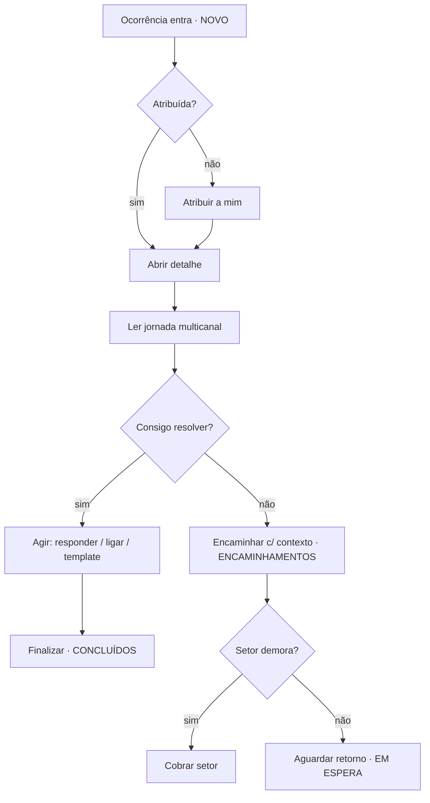
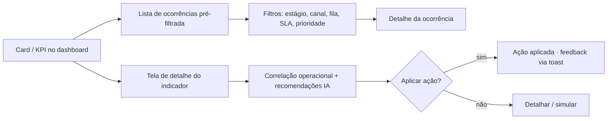
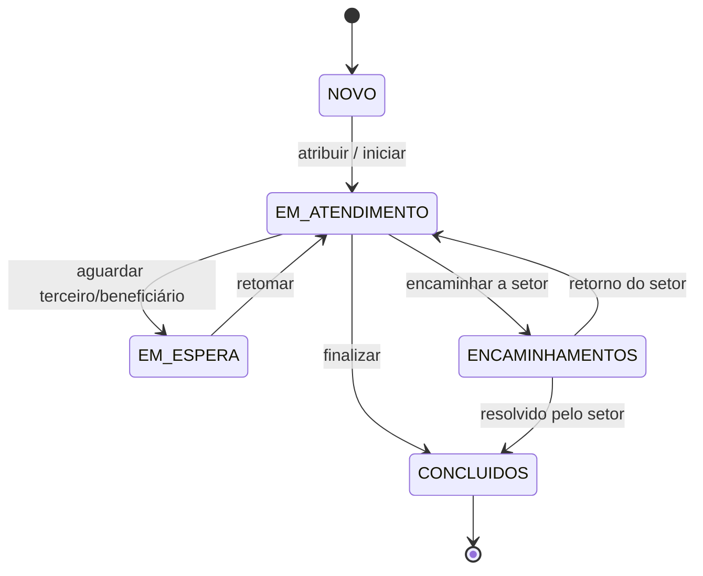
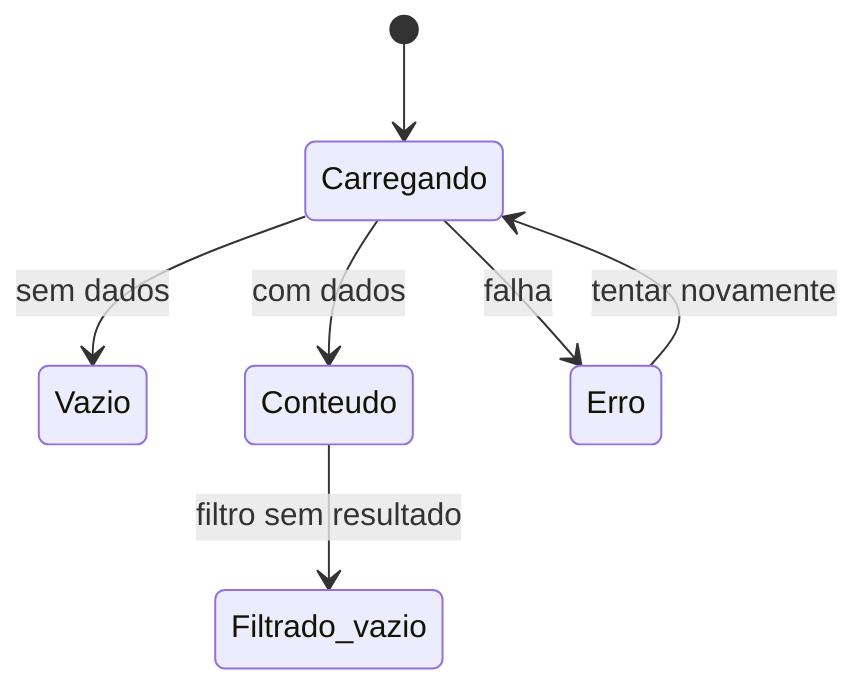
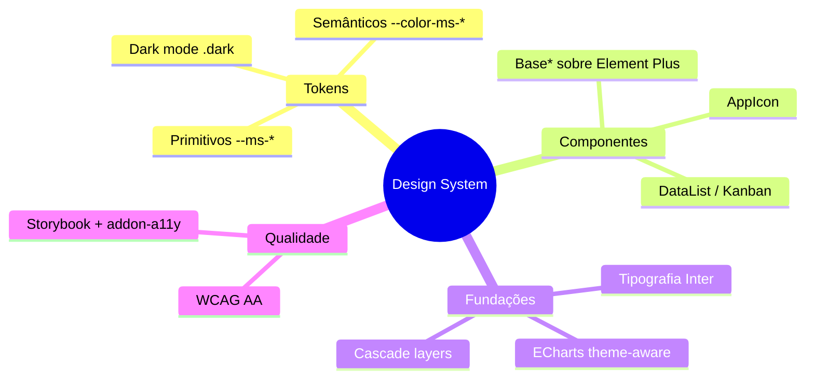
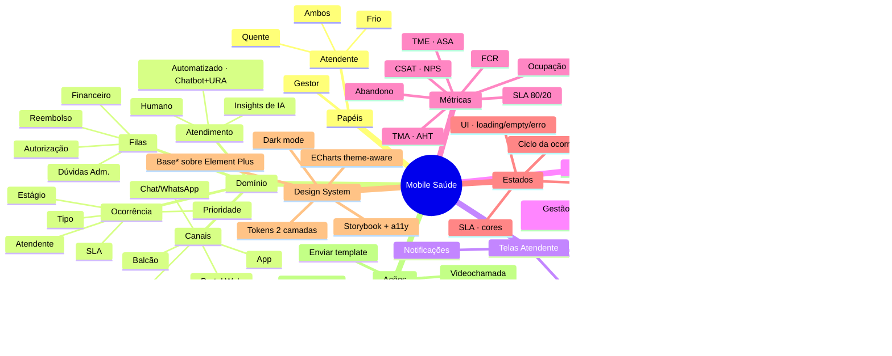

# Mobile Saúde — Documentação de Produto

> **Workspace de Atendimento Omnichannel para operadora de saúde.** Documento de
> referência de produto/design (Product Designer Sênior): contexto, personas,
> PRD, taxonomia de domínio, arquitetura de informação, cenários, jornadas,
> fluxos, estados, design system, benchmark com big players e mindmap completo.
>
> Versão 1.0 · 2026-06-17 · Escopo: app web (Vue 3 + Element Plus + Tailwind).
> Os dados são mock (protótipo de alta fidelidade, sem backend).

---

## Sumário

1. [Visão geral & problema](#1-visão-geral--problema)
2. [Personas, papéis & JTBD](#2-personas-papéis--jtbd)
3. [PRD](#3-prd-product-requirements)
4. [Taxonomia & modelo de domínio](#4-taxonomia--modelo-de-domínio)
5. [Métricas & KPIs](#5-métricas--kpis-definições--benchmarks)
6. [Arquitetura de informação](#6-arquitetura-de-informação)
7. [Cenários](#7-cenários)
8. [Jornadas](#8-jornadas)
9. [Fluxos](#9-fluxos)
10. [Estados](#10-estados)
11. [Design System](#11-design-system)
12. [Benchmark — big players & frameworks](#12-benchmark--big-players--frameworks)
13. [Mindmap completo](#13-mindmap-completo)
14. [Glossário](#14-glossário)
15. [Referências](#15-referências)

---

## 1. Visão geral & problema

A **Mobile Saúde** é o workspace de atendimento de uma operadora de saúde. Centraliza,
num só lugar, o atendimento **omnichannel** (App, WhatsApp/Chat, Telefone/URA,
Portal Web, Balcão/Presencial) e a **gestão operacional** desse atendimento.

**Problema central.** Operações de atendimento em saúde sofrem com: (a) demanda
fragmentada entre canais e ferramentas, forçando o atendente a "trocar de aba";
(b) ocorrências (autorizações, reembolsos, 2ª via, reclamações) com **SLA** que
estoura sem visibilidade; (c) gestores sem leitura **em tempo real** de filas,
abandono e capacidade para agir antes do dano.

**Proposta de valor.**
- **Para o atendente:** uma só superfície — fila ao vivo + ocorrências + jornada
  multicanal do beneficiário — com ações no contexto (encaminhar, finalizar,
  ligar, anexar, templates) e copiloto de IA.
- **Para o gestor:** um cockpit em tempo real (filas, canais, abandono, equipe,
  performance) com **drill-down** unificado para a lista de ocorrências e
  **recomendações de IA** acionáveis.

**Princípios de produto.**
1. *Uma superfície, não muitas abas* (unified workspace).
2. *Do macro ao micro* — todo número leva à ação (drill-down para a lista).
3. *SLA como cidadão de primeira classe* — sempre visível e codificado por cor.
4. *IA assistiva, decisão humana* — insights sugerem; o operador decide.
5. *Acessível e consistente* — WCAG AA, tokens de design, tema claro/escuro.

---

## 2. Personas, papéis & JTBD

O produto tem **dois papéis** (`role`) e, dentro do atendente, **três perfis**
de atuação (`profile`).

### 2.1 Atendente (front-line)
Três perfis (fonte: `stores/profile.ts`):

| Perfil | Rótulo | Atua em |
| ------ | ------ | ------- |
| `quente` | Atendente a quente | **Fila em tempo real** (WhatsApp, ligações…) **+** ocorrências |
| `frio` | Atendente a frio | **Somente ocorrências** (sem fila) |
| `ambos` | Quente e frio | As duas frentes |

**JTBD (Jobs To Be Done):**
- "Quando entra uma demanda na minha fila, quero atendê-la rápido e dentro do SLA,
  para não acumular fila nem gerar abandono."
- "Quando abro uma ocorrência, quero ver toda a jornada do beneficiário (todos os
  canais e atendimentos anteriores), para não pedir que ele repita o histórico."
- "Quando não consigo resolver, quero encaminhar para o setor certo com contexto,
  para que a demanda não volte sem solução."

### 2.2 Gestor / Supervisor
Monitora a operação, diagnostica gargalos e age. JTBD:
- "Quando o SLA começa a cair, quero saber **qual canal/fila** está puxando para
  baixo e **por quê**, para realocar capacidade antes do dano."
- "Quando vejo um número ruim, quero **clicar e chegar nas ocorrências** que o
  causam, sem montar relatório."
- "Quando a IA sugere uma ação, quero entender o impacto estimado antes de aplicar."

### 2.3 Beneficiário (ator indireto)
Não usa este produto, mas é o centro da **jornada multicanal** (App → WhatsApp →
Telefone/URA → Chat/BOT, ao longo de dias). O sistema reconstrói essa jornada na
aba "Conversa" do detalhe da ocorrência.

---

## 3. PRD (Product Requirements)

### 3.1 Objetivo
Reduzir o **tempo de resolução dentro do SLA** e o **abandono**, dando ao
atendente contexto completo e ao gestor visibilidade acionável em tempo real.

### 3.2 North Star & métricas (framework Google HEART)

| Dimensão HEART | Métrica | Sinal |
| -------------- | ------- | ----- |
| **Happiness** | CSAT, NPS | satisfação do beneficiário |
| **Engagement** | ocorrências tratadas/turno; uso do dashboard | adoção operacional |
| **Adoption** | atendentes/gestores ativos | rollout |
| **Retention** | uso recorrente diário | dependência saudável da ferramenta |
| **Task success** | **% SLA cumprido**, FCR, TMA, abandono | eficácia operacional |

**North Star Metric proposta:** *Ocorrências resolvidas dentro do SLA por período*
(combina volume + qualidade + prazo).

### 3.3 Escopo (épicos)

| # | Épico | Telas/artefatos |
| - | ----- | --------------- |
| E1 | **Painel do Atendente** (Início) | fila ao vivo + minhas ocorrências |
| E2 | **Ocorrências** (Quadro Kanban + Lista) | filtros multi-dimensão, colunas configuráveis, filtros salvos |
| E3 | **Detalhe + Jornada multicanal** | header, painel, timeline (`bubble`/`event`/`note`/`divider`…) |
| E4 | **Ações de atendimento** | encaminhar, finalizar, vincular, anexar, nova ligação, videochamada, cobrar setor, enviar template |
| E5 | **Central de Notificações** | role-aware (atendente vs gestor), categorias, buckets temporais |
| E6 | **Dashboard do Gestor — Tempo Real** | abas Início · Atendimentos · Filas · Abandonos · Equipe · Performance |
| E7 | **Telas de detalhe do Gestor** | Operação por Canal, Filas, Central de Automação, Abandonos, Performance, Equipe, Indicadores |
| E8 | **Gestão Operacional de Ocorrências** | Kanban do gestor (estágios automatizado/fila/humano) |
| E9 | **Copiloto & Insights de IA** | diagnóstico + recomendações com impacto estimado |
| E10 | **Design System** | tokens, componentes Base*, Storybook, dark mode, a11y |

### 3.4 Requisitos não-funcionais
- **Acessibilidade:** WCAG 2.1 **AA** (contraste, foco visível, navegação por
  teclado, leitores de tela; piso tipográfico de 12px).
- **Theming:** tema **claro/escuro** por classe `.dark`, via tokens semânticos.
- **Idioma:** pt-BR (locale do Element Plus incluso).
- **Responsividade:** layout fluido (grids `sm/lg/xl`).
- **Performance:** code-splitting por rota; ECharts com tree-shaking.
- **Consistência:** todo padrão de UI repetido vira componente compartilhado.

### 3.5 Fora de escopo (v1)
Backend/persistência real, autenticação/SSO (o switcher de papel é provisório),
relatórios exportáveis, configuração de SLA por contrato, multi-tenant.

---

## 4. Taxonomia & modelo de domínio

Fonte única da verdade: `types/ocorrencias.ts` e `data/gestorTaxonomia.ts`.

### 4.1 Canais (omnichannel)
Canônicos: **Chat/WhatsApp** · **Telefone** · **Balcão/Presencial** · **Portal** ·
**App**. A taxonomia tolera grafias variantes e fixa **uma cor por canal**
(evita o mesmo dado mudar de cor entre telas).

### 4.2 Atendimento: automatizado vs humano
- **Atendimento automatizado** = **Chatbot + URA** (não rotular só "Chatbot").
- Convenção de identidade (não severidade): **BOT = azul**, **Humano = verde**,
  **Insights de IA = roxo**.

### 4.3 Filas / fluxos
Canônicas: **Reembolso · Autorização · Financeiro · Dúvidas Administrativas**.

### 4.4 Ocorrência (entidade central)

| Campo | Valores |
| ----- | ------- |
| `tipoOcorrencia` | Autorização · Reembolso · Segunda via · Reclamação · Cancelamento |
| `prioridade` | Alta · Média · Baixa |
| `sla` | Crítico · Vencido · Atenção · Dentro do prazo · Sem SLA |
| `canal` | App · WhatsApp · Portal Web · Telefone · Presencial |
| `column` (estágio) | NOVO · EM ATENDIMENTO · EM ESPERA · ENCAMINHAMENTOS · CONCLUÍDOS NO DIA |
| `atendente` | atribuído ou "Não atribuídos" |

### 4.5 Notificações
Eixos: **categoria** (SLA e prazos · Sistema · Políticas · Equipe · Atendimento ·
Qualidade), **público** (atendente · gestor · todos), **bucket** (hoje · ontem ·
anteriores) e **estado de leitura** (unread).

---

## 5. Métricas & KPIs (definições + benchmarks)

> Padrões de indústria (verificados — ver §15). **Mapeamento de nomenclatura do
> produto:** `TME` = ASA (Average Speed of Answer); `TMA` = AHT (Average Handle Time).

| KPI | Definição | Benchmark de indústria |
| --- | --------- | ---------------------- |
| **SLA / Nível de serviço** | % de contatos atendidos dentro do limite-alvo | clássico **80/20** (80% em 20s) |
| **TME (ASA)** | tempo médio até o atendimento | ~**20–30s** |
| **TMA (AHT)** | tempo médio de tratamento (fala + espera + pós) | ~**6 min** |
| **Abandono** | % que desiste antes de ser atendido | ~**6%** |
| **Ocupação** | % do tempo logado tratando contatos (vs ocioso) | ~**80%** |
| **FCR** | % resolvido no 1º contato | quanto maior, melhor (↑ CSAT/NPS) |
| **CSAT** | satisfação média do atendimento | benchmark por setor |
| **NPS** | % Promotores (9–10) − % Detratores (0–6) | lealdade |

**Como o produto usa:** cards de KPI com **bolinha de status** (saudável/atenção/
crítico), gauges (KpiRingCard), e correlação operacional (Volume × SLA × TME ×
Ocupação × Espera) para identificar gargalos. O período (Hoje/7d/30d/Trimestre)
**reescala** métricas de volume; taxas/tempos (médias) permanecem estáveis.

---

## 6. Arquitetura de informação

As abas do Dashboard em Tempo Real: **Início · Atendimentos · Filas · Abandonos ·
Equipe · Performance**. Todo card operacional faz **drill-down** para a lista de
ocorrências, pré-filtrada pelo estágio (`automatizado`/`fila`/`humano`).

---

## 7. Cenários

Cenários situacionais que o produto precisa suportar (derivados dos dados mock):

| # | Cenário | Quem | O que o produto oferece |
| - | ------- | ---- | ----------------------- |
| C1 | **Pico vespertino** (volume 18% acima entre 14h–17h) | Gestor | alerta + recomendação de realocar capacidade |
| C2 | **Canal crítico** (Telefone SLA 71%, ocupação 92%) | Gestor | diagnóstico IA: migrar Autorizações para BOT/Chat |
| C3 | **Abandono em escala** (fila telefônica >5min) | Gestor | callback inteligente; drill-down de abandonos |
| C4 | **Atendente saturado** (12/12 ocupados) | Gestor | visão de equipe + status flutuante |
| C5 | **SLA estourando** numa ocorrência | Atendente | chip de SLA (crítico/vencido) + priorização |
| C6 | **Beneficiário multicanal** (App→WhatsApp→Telefone) | Atendente | jornada/timeline unificada |
| C7 | **Demanda sem dono** ("Não atribuídos") | Ambos | filtro + atribuição |
| C8 | **Encaminhamento entre setores** | Atendente | modal Encaminhar + "Cobrar setor" |

---

## 8. Jornadas

### 8.1 Jornada do Atendente (a quente) — turno

### 8.2 Jornada do Gestor — monitorar → diagnosticar → agir

### 8.3 Jornada do Beneficiário (reconstruída na timeline)
App (abre solicitação) → WhatsApp/BOT (triagem) → Telefone/URA (complexo) →
Chat humano (resolução). O produto **costura** esses pontos numa única conversa,
para o atendente não pedir repetição de histórico.

---

## 9. Fluxos

### 9.1 Atender uma ocorrência (atendente)

### 9.2 Drill-down do Gestor (do card ao detalhe)

### 9.3 Ações disponíveis no atendimento
Encaminhar · Finalizar · Vincular · Anexar · Nova ligação · Videochamada ·
Cobrar setor · Enviar template. Cada ação dá **feedback via toast**
(`useActionFeedback`) — confirmação imediata, sem ambiguidade de estado.

---

## 10. Estados

### 10.1 Ciclo de vida da Ocorrência (máquina de estados)

### 10.2 Estados de SLA (cor)
`Sem SLA` → `Dentro do prazo` (verde) → `Atenção` (âmbar) → `Vencido`/`Crítico`
(vermelho). O chip de SLA é onipresente e codificado por cor + rótulo (não só cor —
acessibilidade).

### 10.3 Estados de UI (toda lista/tela)

Padrões: **skeleton** no carregamento, **empty state** com CTA, **erro** com
retry, **estado filtrado-vazio** distinto do vazio inicial. Notificações têm
estado **lida/não-lida**.

---

## 11. Design System

Arquitetura (ver `CLAUDE.md` e Storybook):
- **Tokens em 2 camadas:** primitivos `--ms-*` (valores crus) → semânticos
  `--color-ms-*` (papel/uso). Só os semânticos geram utilitárias e "viram" no tema.
- **Tema claro/escuro** por classe `.dark` no `<html>` (reaponta os semânticos).
- **Componentes Base\*** (BaseButton, BaseInput, BaseSelect, BaseModal, BaseTable…)
  encapsulam o Element Plus; as telas usam os wrappers, não o EP cru.
- **Ícones** via `AppIcon` (sistema único); **gráficos** via ECharts (paleta
  theme-aware); tipografia **Inter**, piso de 12px.
- **Cascade layers** (Tailwind ↔ Element Plus) resolvem o conflito de preflight
  sem desligar o reset.
- **Storybook** é a fonte viva do DS (catálogo + a11y addon).
- **Acessibilidade:** foco visível, contraste AA, `role`/`aria-*`, navegação por
  teclado; "on-color" calculado para texto sobre preenchimentos.

---

## 12. Benchmark — big players & frameworks

**Plataformas de referência (agent workspace / service):**

| Player | Padrão que inspira o Mobile Saúde |
| ------ | --------------------------------- |
| **Zendesk** Agent Workspace | *unified omnichannel* + **copilot** de IA no contexto |
| **Salesforce** Service Cloud | console de caso + **omni-channel routing** + drill-down |
| **Intercom** | inbox unificada + automação de IA para escala |
| **Freshdesk / Twilio Flex / Genesys** | fila/roteamento, métricas em tempo real |

**O que adotamos (e por quê):** uma só superfície (reduz "troca de aba", padrão
unânime entre os players); IA **assistiva** com impacto estimado (não auto-executa);
drill-down do número à ocorrência (case-centric como Service Cloud); jornada
multicanal unificada (como o histórico unificado do Agent Workspace).

**Frameworks de produto/design aplicados:**
- **Marty Cagan / SVPG (Inspired)** — estrutura de PRD orientada a resultado.
- **Jobs To Be Done** — requisitos ancorados em "quando… quero… para…".
- **Google HEART** — métricas de UX (§3.2).
- **Nielsen Norman Group** — *journey mapping* e as 10 heurísticas de usabilidade
  (visibilidade do estado, controle do usuário, consistência…).
- **Material 3 / Adobe Spectrum** — modelo de design tokens em camadas.
- **WCAG 2.1 AA** — acessibilidade.

---

## 13. Mindmap completo

---

## 14. Glossário

- **Ocorrência** — unidade de trabalho (caso): autorização, reembolso, 2ª via, etc.
- **SLA** — prazo-alvo de atendimento/resolução; codificado por cor.
- **TME / ASA** — tempo médio até o atendimento.
- **TMA / AHT** — tempo médio de tratamento.
- **Atendimento automatizado** — Chatbot **+** URA.
- **Drill-down** — navegar do número agregado até as ocorrências que o compõem.
- **Jornada multicanal** — histórico do beneficiário costurado entre canais.
- **Atendente quente/frio** — atua na fila ao vivo / só em ocorrências.

---

## 15. Referências

**Padrões de agent workspace / omnichannel:**
- [Zendesk — Unified omnichannel & self-service](https://www.zendesk.com/blog/zendesk-insights/expertise/transform-your-contact-center-omnichannel-self-service/)
- [Zendesk — Call center metrics & KPIs](https://www.zendesk.com/blog/ccaas/call-center/ultimate-guide-call-centers/call-center-metrics/)
- [Nextiva — Call center metrics & KPIs](https://www.nextiva.com/blog/call-center-metrics.html)

**Definições/benchmarks de KPIs:**
- [SQM Group — Industry standards for top call center KPIs](https://www.sqmgroup.com/resources/library/blog/industry-standards-top-call-center-kpis)
- [Connectel — Industry standards for contact center metrics](https://connectel.io/blog/industry-standards-for-contact-center-metrics/)
- [First call resolution (Wikipedia)](https://en.wikipedia.org/wiki/First_call_resolution)
- [Medallia — Net Promoter Score](https://www.medallia.com/experience-101/glossary/net-promoter-score/)

**Frameworks:** Marty Cagan/SVPG (*Inspired*); Jobs To Be Done; Google HEART;
Nielsen Norman Group (journey mapping + 10 heurísticas); Material 3 & Adobe
Spectrum (design tokens); WCAG 2.1 AA.

> Observação: os números do produto (SLA 84%, Telefone 71%, etc.) são **mock** do
> protótipo; os benchmarks acima são da indústria e servem de calibração.
