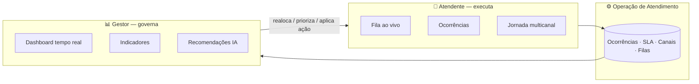

# Mobile Saúde — Visão Geral do Projeto

> Documento de **visão geral** (executivo) do produto, pelos principais tópicos e
> sob as duas óticas — **Atendente** e **Gestor**. Para o detalhamento (PRD,
> jornadas, estados, fluxos, métricas), ver [PRODUTO-MOBILE-SAUDE.md](PRODUTO-MOBILE-SAUDE.md).
>
> Inclui uma seção final de **Propostas de evolução** (sugeridas como Product
> Designer Sênior, fundamentadas nos gaps atuais + benchmark de big players).
>
> Versão 1.0 · 2026-06-17 · Dados do produto são mock (protótipo de alta fidelidade).

---

## 1. O que é

A **Mobile Saúde** é o **workspace de atendimento** de uma operadora de saúde:
um só lugar para **atender** (omnichannel) e **gerir** o atendimento.

- **Problema que resolve:** demanda fragmentada entre canais e ferramentas, SLA
  que estoura sem visibilidade, e gestão que reage tarde por falta de leitura em
  tempo real.
- **Proposta de valor:** *uma superfície* que une fila ao vivo, ocorrências,
  jornada multicanal do beneficiário e ações no contexto (atendente); e um
  *cockpit em tempo real* com drill-down e recomendações de IA (gestor).
- **Princípios:** uma superfície (não muitas abas) · do macro ao micro (todo
  número leva à ação) · SLA sempre visível · IA assistiva (decisão é humana) ·
  acessível e consistente (WCAG AA, tema claro/escuro).

---

## 2. As duas visões

O produto serve **dois papéis** sobre a **mesma operação** — o que o atendente
faz vira o que o gestor mede; o que o gestor decide redireciona o atendente.

| | **Atendente** | **Gestor** |
| --- | --- | --- |
| **Objetivo** | resolver a demanda rápido e dentro do SLA | manter a operação saudável (SLA, abandono, capacidade) |
| **Pergunta-chave** | "qual é o próximo e como resolvo?" | "onde está o gargalo e o que faço?" |
| **Telas-chave** | Início, Ocorrências, Detalhe+Jornada, Notificações | Tempo Real, Indicadores, Detalhes, Gestão Operacional |
| **Métrica que importa** | SLA da minha ocorrência, FCR | SLA agregado, abandono, ocupação |
| **Perfis** | quente (fila ao vivo) · frio (só ocorrências) · ambos | — |

---

## 3. Principais tópicos do projeto

Cada tópico descrito pelas **duas lentes**.

### 3.1 Atendimento omnichannel & jornada do beneficiário
Canais: **Chat/WhatsApp · Telefone/URA · Portal Web · App · Balcão**. O
atendimento pode ser **automatizado** (Chatbot + URA) ou **humano**.
- **Atendente:** vê a **jornada multicanal** unificada (o mesmo beneficiário
  passando por App → WhatsApp → Telefone → Chat ao longo dos dias) — não pede que
  ele repita o histórico.
- **Gestor:** acompanha **distribuição por canal** e a fronteira **BOT × humano**
  (taxa de automação, retenção do bot).

### 3.2 Ocorrências — operar × governar
A **ocorrência** é a unidade de trabalho (autorização, reembolso, 2ª via,
reclamação, cancelamento), com **prioridade**, **SLA** e **estágio**.
- **Atendente:** quadro **Kanban** + **lista** com filtros, colunas configuráveis
  e ações no contexto (encaminhar, finalizar, vincular, anexar, ligar, vídeo,
  templates).
- **Gestor:** **Gestão Operacional** (Kanban por estágio automatizado/fila/humano)
  e drill-down de qualquer número até as ocorrências que o originam.

### 3.3 Tempo real & indicadores (cockpit do Gestor)
- **Gestor:** Dashboard em **abas** (Início · Atendimentos · Filas · Abandonos ·
  Equipe · Performance), KPIs com status, **correlação operacional**
  (Volume × SLA × TME × Ocupação × Espera) e telas de detalhe por tema.
- **Atendente:** recebe o reflexo (priorização, realocação) via fila e
  notificações — não consome o dashboard.

### 3.4 Notificações (ambos)
Central **role-aware**: o atendente vê alertas das suas demandas/SLA; o gestor vê
por **atendente/setor**. Eixos: categoria (SLA, sistema, política, equipe,
atendimento, qualidade), público e tempo (hoje/ontem/anteriores).

### 3.5 IA & copiloto (ambos)
- **Atendente:** copiloto sugere próximos passos/templates no contexto.
- **Gestor:** **diagnóstico + recomendações** com **impacto estimado** (ex.:
  "migrar Autorizações do Telefone para BOT → SLA +6pp"). IA sugere; o humano
  decide e aplica.

### 3.6 Design System & acessibilidade (transversal)
Tokens de design em 2 camadas, componentes `Base*` sobre Element Plus, tema
claro/escuro, ícones e gráficos theme-aware, **WCAG AA**, catálogo no Storybook.

---

## 4. Domínio em uma página

| Eixo | Valores |
| ---- | ------- |
| **Canais** | Chat/WhatsApp · Telefone · Portal Web · App · Balcão/Presencial |
| **Atendimento** | Automatizado (Chatbot + URA) · Humano · Insights de IA |
| **Filas** | Reembolso · Autorização · Financeiro · Dúvidas Administrativas |
| **Tipo de ocorrência** | Autorização · Reembolso · 2ª via · Reclamação · Cancelamento |
| **Prioridade** | Alta · Média · Baixa |
| **SLA** | Dentro do prazo · Atenção · Vencido · Crítico · Sem SLA |
| **Estágios** | Novo → Em atendimento ⇄ Em espera → Encaminhamentos → Concluídos |

---

## 5. Métricas que importam

| KPI | O que mede | Lente |
| --- | ---------- | ----- |
| **SLA** (80/20) | % atendido dentro do prazo | ambos |
| **TME** (ASA) | tempo médio até atendimento | gestor |
| **TMA** (AHT) | tempo médio de tratamento | gestor |
| **Abandono** | % que desiste antes de ser atendido | gestor |
| **Ocupação** | % do tempo tratando contatos | gestor |
| **FCR** | resolvido no 1º contato | ambos |
| **CSAT / NPS** | satisfação e lealdade | ambos |

(Definições e benchmarks de indústria no [PRD §5](PRODUTO-MOBILE-SAUDE.md#5-métricas--kpis-definições--benchmarks).)

---

## 6. Stack (resumo)

Front-end **Vue 3 + TypeScript (Vite)**, UI com **Element Plus** + **Tailwind**,
gráficos **ECharts**, ícones via sistema único, estado em **Pinia**. Tema
claro/escuro e acessibilidade AA de base. *(Há um porte da stack para o ambiente
do time documentado à parte — ver `DE-PARA-STACK-ANTIGA.md`.)*

---

## 7. Propostas de evolução (sugeridas — PD Sênior)

Derivadas dos **gaps atuais** + **benchmark** (Zendesk, Salesforce Service Cloud,
Intercom). Marcadas com **Impacto** (Alto/Médio) e **Esforço** (P/M/G). São
sugestões para o time validar/priorizar — não compromisso.

### 7.1 Atendente
| Proposta | Hoje → Evolução | Impacto · Esforço | Referência |
| -------- | --------------- | ----------------- | ---------- |
| **Roteamento omnichannel automático** | atribuição manual / "não atribuídos" → distribuição por skill/carga/SLA | Alto · G | Salesforce Omni-Channel Routing |
| **Base de conhecimento + sugestões no contexto** | templates fixos → KB pesquisável + sugestão de resposta da IA | Alto · M | Zendesk Agent Copilot |
| **Macros/ações em lote** | ações 1 a 1 → macros (sequência de passos) e ações em massa na lista | Médio · M | Zendesk macros |
| **SplitView (2 painéis)** | navegação por abas (fase 1) → split lista+detalhe lado a lado | Médio · M | Gmail/Front split inbox |
| **Colaboração/handoff** | encaminhar → menção interna + transferência com contexto e nota privada | Médio · M | Intercom inbox |

### 7.2 Gestor
| Proposta | Hoje → Evolução | Impacto · Esforço | Referência |
| -------- | --------------- | ----------------- | ---------- |
| **SLA configurável por contrato/fila** | SLA fixo → políticas de SLA por plano/fila com alertas de breach | Alto · M | Service Cloud Entitlements |
| **IA preditiva (forecast de demanda)** | leitura reativa → previsão de pico e sugestão de escala antecipada | Alto · G | Genesys/WEM forecasting |
| **Relatórios e export** | dashboards na tela → relatórios agendados (CSV/PDF) e compartilháveis | Médio · M | padrão de mercado |
| **Aplicar ação de IA de ponta a ponta** | recomendação informativa → executar a ação (com trilha/auditoria) | Alto · G | — |

### 7.3 Transversal
| Proposta | Hoje → Evolução | Impacto · Esforço |
| -------- | --------------- | ----------------- |
| **Autenticação + RBAC real** | switcher de papel provisório → login/SSO e permissões por papel | Alto · M |
| **Coleta automática de CSAT/NPS** | métricas mock → pesquisa pós-atendimento real alimentando os KPIs | Alto · M |
| **Responsivo/mobile** | foco desktop → uso confortável em tablet/mobile | Médio · M |
| **A11y contínua no CI** | a11y de base → testes axe no Storybook travando regressões | Médio · P |
| **Backend/persistência** | dados mock → API real, tempo real (websockets) nas filas | Alto · G |

---

## 8. Como navegar a documentação
- **Esta visão geral** — entrada rápida (stakeholders, onboarding).
- **[PRODUTO-MOBILE-SAUDE.md](PRODUTO-MOBILE-SAUDE.md)** — PRD completo: personas,
  jornadas, fluxos, estados, métricas, benchmark, mindmap.
- **`docs/export/`** — versões para Confluence (`.docx`) e PDF + diagramas.
- **`DE-PARA-STACK-ANTIGA.md`** — porte da stack para o ambiente do time.
